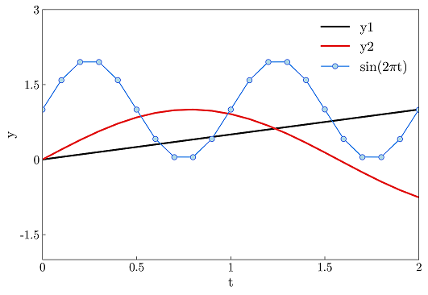
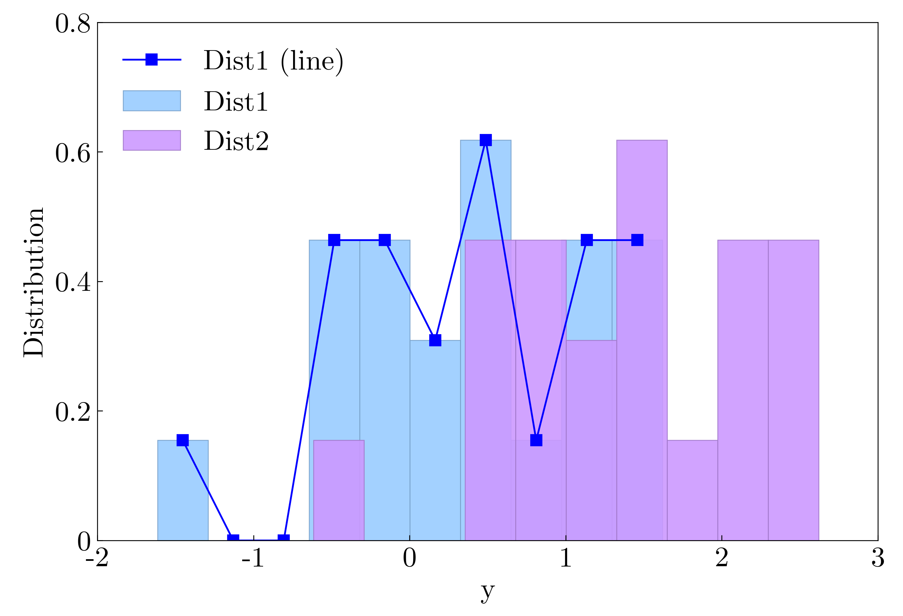

# LINE

Creating nice academic-style plot with least typing.

## Installation

Prerequesties:

- Python >= 3.5 (Necessary)
- Matplotlib >= 3.0 (Necessary)
- Numpy >= 1.13 (Necessary)
- Pandas >= 0.22 (Necessary)
- Prompt-toolkit >= 3.0 (Optional, for colorful prompts)
- IPython >= 7.19.0 (Optional, for prompts)
- Flask >= 1.1 (Optional, for remote plotting)

The package is written in pure python and is directly executable. To install it into python library:

    pip install -e line

## Features

The plotting grammar of Line is similar (but looser) with Gnuplot. The major differences are:
- No quote for filename is needed if column entries are given. i.e. `plot 'filename' 1:2` in Gnuplot is equvalent to `plot filename 1:2` in Line;
- Supports matlab-style line description (like "r-", "kd--");
- No requirement for frequent `replot`. The replotting is automatically done when there is anything changed (but certainly you can manually replot);
- Uniform description of style elements. Line uses CSS model to select and modify element styles, therefore the syntax for getting/setting styles are simple and straightforward;
- A better palette system. Setting palette only requires one command, and one can easily change the color order via modifying `groupid` or using `group` command.
- Remote plotting.

## Quickstart

The full documentation can be found [here](doc/doc.md), which includes [command-line options](doc/doc.md#command-line-options), [command reference](doc/doc.md#command-reference), [expressions](doc/doc.md#expressions) and [styles](doc/doc.md#styles).

### Launch

Launch in interactive mode:

    line

Run a script:

    line [scriptname]

Execute commands directly:

    line -e [commands]

Plot from file directly:

    line -p [filename] (columnx:)(columny)

### Plotting

Line provides various ways to select columns:

    line> plot test-data.txt 2          # plot second column against data index
    line> plot test-data.txt $0:2       # same as above, since '$0' is data index
    line> plot test-data.txt 1:2        # plot second column agianst first column
    line> plot test-data.txt 1:2,3      # plot second and third column against first column
    line> plot test-data.txt t:y1       # plot column 'y1' against column 't'
    line> plot test-data.txt 1:y1       # plot column 'y1' against first column
    line> plot 'test-data.txt'          # plot remained columns against first column
    line> plot 'test-data.txt', 'hist-data.txt' # plot two files

Customize line styles while plotting:

    line> plot test-data.txt t:y1 t='second column'  # set data title
    line> plot test-data.txt t:y1 lw=2 lc=red        # plot with linewidth and linecolor set
    line> plot test-data.txt 1:2 'rx-'               # plot with line descriptor
    

The data delimiter and existence of head is automatically determined, but can be specified by *data-delimiter* and *data-title* options.
Append data to existing figure ("hold on"):

    line> add test-data.txt 3       # add the third column

### Adjusting styles

Adjust ranges, scales, grids, legends, etc. (the beginning "set" can be omitted):

    line> set xrange 0:2        # setting x range, the 'set' can be omitted
    line> xrange 0:2            # setting x range
    line> xscale log            # set x scale
    line> ylabel 'y'            # set ylabel
    line> grid on               # show grid
    line> grid lt=dash          # setting grid style
    line> legend off            # hide legend
    line> legend pos=top,left   # set legend position

More setting commands:

    line> set tick format='%.3f'        # set tick format
    line> set label fontfamily=Arial    # set label font
    line> set line lw=2                 # set linewidth of all data lines
    line> set line1 lw=2                # only set line0
    line> set line:label='data3' color=red      # set line with certain label to red
    line> set option auto-adjust-range=false    # disable automatic range adjust
    line> set palette mpl.OrRd          # set palette
    line> set palette lighter bar       # set palette for bars

Its counterparts, "show" command, displays all style parameters.

    line> show line1        # show all attributes of line1
    line> show line lw      # show linewidth of all lines

### Writting scripts

Load a script:

    load [scriptname]

Display figure in a script:

    display

Interrupt script running and switch to interactive mode:

    input

Note Line will not display the figure unless `display` or `input` are given. The command `input` is useful when one needs to modify scripts.

## Configuration

Line reads `.linerc` in user's home directory, which is just a script. You can also use `load` command to specify configurations.

More custom style classes can be added to [styles/defaults.d.css](line/styles/defaults.d.css). Palettes can be added to [styles/palettes.json](line/styles/palettes.json).
