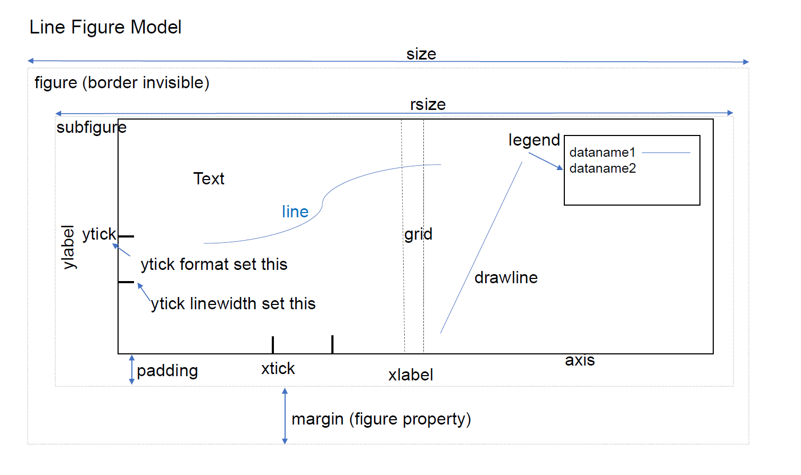

# Line Documentation

Version: v0.2

Structure of this documentation:

- [Command Line Options](#command-line-options)
- [Command Reference](#command-reference)
- [Expressions](#expressions)
- [Styles](#styles)
- [Remote Plotting](#remote-plotting)

## Command Line Options

Entering interactive mode:

    line 

Run script (in non-interactive mode):

    line [scriptname]

Run commands in line (in non-interactive mode):

    line -e 'command1;command2;...'

Plotting file directly (the grammar is same as the [plot](#plot) command):

    line -p [filename] (col_selection) (styles), ...

### Global Switches

By passing optional arguments to line, you can control the program behavior. The usage is

    line --name=value

This works in all three modes. The options can also be changed via `set option name=value` in the commands or (globally) by modifying [options.ini](../line/styles/options.ini).

Available options are:

name | avaiable values | default | function
--- | --- | --- | ---
auto-adjust-range | true/false | true | Adjust the range of axis automatically when plotting new data
auto-compact | true/false | true | Always make the figure compact
auto-trigger-remote | true/false | true | In interactive mode, update remote without "display" explicitly
data-title | true/false/auto | auto | Treat the first row of data as title
data-delimiter | any char/'white'/'auto' | auto | Delimiter of data
delayed-init | true/false | true | Delayed loading modules in interactive mode
display-when-quit | true/false | false | Always try to display the figure when exiting program (except when having errors)
direct-function-call | true/false | true | Allows calling custom function without 'call' prefix
*fancy-prompt | true/false | true | Uses prompt_toolkit as input frontend (requires prompt_toolkit>=3 and ipython)
*font-family-math | cm/stix | cm | Latex font family used by backend
full-label | true/false | false| Always use "filename:column" format for labels
ignore-data-comment | true/false | true | Ignore lines begin with '#'
*mpl-backend | string split by ',' | Qt5Agg,Qt4Agg,TkAgg | Displaying backend used by MPL
*mpl-silent-backend | string | Agg | File writing backend used by MPL
*remote | true/false | false | Plotting on [remote backend](#remote-plotting) (requires flask)
*physical-figure-size | float,float | 7.2,4.8 | The physical figure size used in DPI scaling
*port | int | 8100 | Port of remote plotting
prompt-always | true/false | false | Prompt in file mode
prompt-multi-removal | true/false | true | Prompt when removing more than one element
prompt-overwrite | true/false | true | Prompt when saving to an existing file
prompt-save-when-quit | true/false | false | Prompt "save current figure" when quitting interactive mode
rescale-when-split | true/false | true | Change figure's size when splitting
safety | 0/1/2 | 1 | When executing python code, 0=>continues; 1=>displays a warning; 2=>prompts for allowance

\* Only take effects by setting in options.ini or command arguments.

## Command Reference

Contents:

- [append,add](#append)
- [cd](#cd)
- [call](#call)
- [clear,cla](#clear)
- [display](#display)
- [figure,fig,subfigure,subplot,sp](#figure%44-subfigure)
- [fill](#fill)
- [fit](#fit)
- [for](#for)
- [group](#group)
- [grid](#special-set-commands)
- [hist](#hist)
- [hold](#special-set-commands)
- [if](#if)
- [input](#input)
- [legend](#special-set-commands)
- [let](#let)
- [load](#load%44-source)
- [line,hline,vline](#line%44-hline%44-vline)
- [ls](#pwd%44-ls)
- [palette](#special-set-commands)
- [pause](#pause)
- [plot,p](#plot)
- [plotr,plotyy](#plotr)
- [print](#print)
- [pwd](#pwd%44-ls)
- [quit,exit,q](#quit)
- [redo](#undo%44-redo)
- [remove](#remove)
- [replot](#replot)
- [save](#save)
- [set,s](#set)
- [source](#load%44-source)
- [split,hsplit,vsplit](#split%44-hsplit%44-vsplit)
- [style](#set)
- [show](#show)
- [title](#special-set-commands)
- [text](#text)
- [update](#update)
- [undo](#undo%44-redo)
- [xlabel,ylabel](#special-set-commands)
- [xrange,yrange](#special-set-commands)
- [xscale,yscale](#special-set-commands)

### plot
---

Alias: p

Plot data from file to current subfigure. Any exisiting lines will be removed.

Usage:

    plot (source1) (xexpr:)(yexpr) (style=val) (linespec) ..., (source2) (xexpr2:)(yexpr2) (style=val), ...

Example:

    plot a.txt 1:2 lw=2, lc=red, 3 lc=blue, ($4+1) lc=green
    plot a.txt t:x r-,y b-

Args:

- source: Variable name, filename or [expression](#expressions). If source is not given, the previous source in current command is used.
    - If no xexpr, yexpr are given, filename with "/" must be quoted (otherwise it will be treated as a division expression);
    - Expression must be quoted by `$()`;
- xexpr, yexpr: Column index, column title, or [expression](#expressions).
    - If the expr is a single token, it will be automatically mapped to column title or index. See [Automatic Variable Mapping](#automatic-variable-mapping).
    - If xexpr is omitted, the xaxis will be the data indices.
    - If xexpr and yexpr are both omitted, all columns in the file are added into current figure. If there are multiple columns and the source is a file, the first column is treated as x column.
- style, val: Styles of the plotted line. See [Style name and value](#list-of-valid-style-values).
- linespec: Matlab-style line descriptor, which consists of short abbreviation of various line/point types and colors. See [this link](https://www.mathworks.com/help/matlab/ref/linespec.html) for details.

Related options:

- --ignore-data-comment=true/false: If true, ignore lines starting with `#`. (Default: true)

- --data-delimiter=(delimiter)/white/auto: Set the data delimiter. 'white' means both tab and space. 'auto' means automatically identifing. (Default: auto).

- --data-title=true/false/auto. Do/don't Treat the first row of data as title. (Default: auto).

### plotr
---
Plot with data line attached to the right axis.

Usage:

    plotr (source1) (xexpr:)(yexpr) (style=val) (linespec) ..., (source2) (xexpr2:)(yexpr2) (style=val), ...

The args are same as [plot](#plot). Note plotr will set `y2axis.enabled`, `y2axis.visible`, `y2tick.visible` and `y2label.visible` to true.

### hist
---

Plot histogram from data.

Usage:

    hist (source1) (expr1) (style=val) ..., (source2) (expr2) (style=val), ...

Arguments:
- source, expr: Same as in [plot](#plot).

The bin number of histogram can be set as `bin=[value]`.

### append
---

Alias: add

Append data to current subfigure without removing existing plots. See [plot](#plot) for details.

### update
---

Update data of exisiting datalines without changing styles.

Usage:

    update line1,line2,... (source1) (xexpr:)(yexpr), (source2) (xexpr2:)(yexpr2), ...

Args:
- line1,line2: Identifier of lines (usually just "line" + digit), see [Element Selector](#element-selector) for details.
- source, xexpr, yexpr: See [plot](#plot) for details.

The data generated by source and expressions should have equal columns as the number of lines selected. Otherwise an error will be raised.

## fit
---

Fit line(s). The fitted expression are stored in variable 'fit' as a list.

Usage:

    fit line1,line2,... (rule) (style=val) ...

Args:

- line1,line2: Identifier of lines (usually just "line" + digit), see [Element Selector](#element-selector) for details.
- rule: One of "linear","quad","exp","prop" (proportional). If omitted, using linear fit.
- (style=val): Styles of the plotted line. See [Style name and value](#list-of-valid-style-values).
    - when setting "label='\$\%E\$'", displays the latex expression as line label. This cannot be set via `set` command.

### remove
---

Alias: rm

Remove objects in current subfigure. Can only remove datas, lines and texts.

Usage:

    remove selection1, selection2 ...

Args:

- selection1,selection2: Selections of elements, must be line, bar, drawline, polygon or text. See [Element Selector](#element-selector) for details.

Line indices will change if there are lines removed. Use `show line label` to see the indices.

Related options:

- --prompt-multi-removal: Prompt before removing multiple line by style filter. (Default: true)
- --remove-element-by-style: Remove other graphic elements by style. If false, only remove data lines with certain style. (Default: false)

### group
---

Batch change lines' colorid and groupid. See [Palette System](#palette-system) for details.

Usage:

    group AABBC0
    group 1122...0
    group ABCABC...
    group clear

`colorid` is bind to each character according to its first occurence. For example, "AABBC" will set colorid 1,1,2,2,3. "AACCB" will set the same sequence.
`groupid` is set according to the repeated times of a character. For example, "AABBC" will set `groupid` to 1,2,1,2,1. groupid can be useful to change style pairwisely, like `set line +pairdash`.
However, Identifier "0" always has colorid 0 and groupid 0. It is usually a black solid line.

The "..." will be expanded by the last repeating unit before it. There are two ways to expand the repeating unit. One is direct repeating:

    ABCABC... -> ABCABCABC
    ABCCC... -> ABCCCCC
    ABCC...D -> ABCCCCCCD

The other is incremental repeating:

    AABBCCDD... -> AABBCCDDEE
    AAABBBCCC... -> AAABBBCCCDDD

`group` will automatically determine the way of expansion.

### set
---

Alias: s

Alias for `set future`: style

Set style parameters.

Usage:

    set (future/default) (selection1,selection2,...) style1=val1 style2=val2 +class1 -class2 ...
    set (future/default) (selection1,selection2,...) clear
    set option opt=arg
    set palette (type) palettename

Example:

    set default figure dpi high
    set line lw=2
    set line lw=$(1+1)
    set line +paircross
    set gca hold on
    set gca legend=$(["legend1", "legend2"])

Args:
- selection1,selection2: [Element Selector](#element-selector). If not given, the style is applied to current subfigure. Note in `set default` and `set future`, the selection cannot be omitted and has certain constraint.
- style, val: Style should be a valid style for certain elements. Value may be a plain value (parsed automatically) or expression enclosed in `$( ... )`.
- class: The style classes to be added or removed.
- `set default` modifies default value of styles, same as updating `default.css` (but not permanently). Only element type selector can be used in `set default`.
- `set future` modifies the global stylesheet, same as updating `default.d.css` (but not permanently). The selectors for `set future` should only be classes.
- `set palette (type)` changes palette for line (default), point, bar, polygon or drawline. The avaiable palette names can be viewed via `show palette` command. Custom palette can be created in [palettes.json](../line/styles/palettes.json).
- `set option` changes default options, e.g. `set option ignore-data-comment=true`. See [Global Switches](#global-switches) for all avaiable options.

#### Special Set Commands

If the first parameter of set is in the following list, then the "set" word can be omitted. 

- grid
- hold
- legend
- palette
- title
- xlabel, ylabel, x2label, y2label
- xrange, yrange, x2range, y2range
- xscale, yscale, x2scale, y2scale

Examples:

    hold on # ==> set gca hold on
    grid on # ==> set gca grid visible=true
    xlabel "t" # ==> set gca xlabel "t"
    xrange 0:10 # ==> set gca xrange 0:10

### show
---

Display element style, options and miscellaneous info.

Usage:

    show selection1,selection2, ... (stylename)
    show currentfile
    show pwd
    show option [optionname]

Args:
- selection1,selection2: Selections of elements, see [Element Selector](#element-selector) for details.
- stylename: [Name of style](#list-of-valid-style-values). All styles parameters will be shown if not given.
- `show currentfile` shows current save filename;
- `show palettes` shows all palettes available;
- `show option` shows current global option.
    

### fill
---

Fill under current line or between lines.

Usage:

    fill line1 line2 (style=val ...)   # fill the area under line1 and line2, using sequential colors
    fill line1-line2 (style=val ...)   # fill the area between line1 and line2

`fill` will generate polygon objects, available for style customizing.

- line1,line2: Identifier of line (usually just "line" + digit), see [Element Selector](#element-selector) for details.
- style, val: Styles of the plotted line. See [Style name and value](#list-of-valid-style-values).

### line, hline, vline
---

Draw line on current subfigure. `hline` and `vline` draws horizontally and vertically.

Usage:

    line x1,y1 x2,y2 (style=val ...)
    hline y1 (style=val ...)
    vline x1 (style=val ...)

- x1,x2,y1,y2: Start and end position. By default it's data coordinate. You can change it by specifying `coord=data/axis`.
- style, val: Styles of the plotted drawline. See [Style name and value](#list-of-valid-style-values).

### text
---

Display text in current figure.

Usage:

    text string pos (style=val ...)

Args:

- pos: Positions 'x,y'. By default it's axis coordinate. Specify `coord=data/axis` to change it.
- style, val: Styles of the text. See [Style name and value](#list-of-valid-style-values).

### split, hsplit, vsplit
---

Create subfigures.

Usage:

    split hnum,vnum
    hsplit hnum
    vsplit vnum

Args:

- hnum,vnum: Numbers of subfigures in horizontal/vertical direction. If it is less than current number, extra subfigures will be removed.

Related options:

- --resize-when-split: Resize the figure automatically when spiltting.

### figure, subfigure
---

Alias of figure: fig

Alias of subfigure: subplot, sp

Select figure or subfigure.

Usage:

    figure (title)
    subfigure index
    subfigure vnum,hnum,index

The behavior of `figure` is similar with matlab's `figure()`. It creates new figure and bring it to the front. Title is not necessary.

The index of subfigure is an integer, starting from left to right and then top to bottom. If `vnum` and `hnum` are given, figure will be split first.

Both indices start from 1.

### save
---

Save current figure to file.

Usage:

    save (filename) (remote)

If filename is not present, save will prompt for a new filename. It will also prompt for a new filename (or overwrite) if file exists. Filename may be a variable or expression (will try to convert the result to string).

If remote is specified, then generate a data url of the image on the remote end.

Related options:

- --prompt-overwrite=true/false: Prompt before overwritting a file. (Default: true). To use this option in non-interactive mode, set --prompt-always to true.
- --remote=true/false: Enable/disable remote saving;

### clear
---

Alias: cla

Clear current subfigure but keeps style.

Usage:

    clear

Use `set gca visible=false` to completely hide current subfigure.

### replot
---

Refresh the current subfigure or figure (if "all" is present). This is sometimes useful when setting the figure to be compact.

Usage:

    replot
    replot all

### undo, redo
---
 
Undo and redo in interactive mode.

Usage:

    undo
    redo

The following commands can be reverted:
- Plotting commands: plot, append, plotr, hist, line, text;
- Styling commands: set, style (except "set option", "set default" and "set compact"), group;
- Element commands: remove (except figures and subfigures), clear;

The following operations cannot be reverted:
- Creation of new figures;
- Split of subfigures using "split" or "subfigure";
- Removal of figures and subfigures;
- Loading/sourcing external files;
- Switch between input mode amd file mode.

The history will be cleared if any of above operations are performed. All other commands, variables, functions and global switches are transparent to the editing history.

The default maximum history size is 20.

### print
---

Print a string. Will try executing expression (starting with `$`) before print.

Usage:

    print WORD1 WORD2 ... ( > TERMINAL )

Example:

    print 'Hello world'
    print 'x=' $(x) > stdout
    print $(1+2) > remote

The terminal can be stdout, stderr and remote. By default, remote is used in remote environment and stdout is used otherwise. Any expressions will be evaluated before print.

### input
---

Switch to interactive mode if current mode is not interactive. This is useful in line input and script input. All exisiting figures will be displayed.

Usage:

    input

To function properly, `input` must be the last command of one line.

### display
---
Display the current figure. Only works in non-interactive mode or remote mode (either interactive or non-interactive).

Usage:

    display

In remote mode, `display` will always display on the remote backend.

Related options:

- --auto-trigger-remote: If set, remote side is automatically updated (without display command) in interactive mode.

### load, source
---
Load an external script. Additional arguments may be passed.

Usage:

    load filename [args...]
    source filename [args...]

The arguments will be available via `arg()` function. Number of arguments can be obtained via `argc()` function.

When using `load`, the working directory will be changed and the displaying mode will always be set to file mode. `source` will preserve both the working directory and the displaying mode, which could be faster in some cases.

`source` is not available for legacy prompts (--fancy-prompt=false).

### cd
---
Change directory.

Usage:

    cd path

### pwd, ls
---
Show current directory and files.

Usage:

    pwd
    ls

### quit
---

Alias: exit, q

Quit the program.

Usage:

    quit

Related options:
- --prompt-save-when-quit=true/false: Prompt to save current figure when quitting. (Default: false).
- --display-when-quit=true/false: Display figure when quitting the program. (Default: false).

### pause
---

Pause the program.

Usage:

    pause [time]

Args:

- time: In seconds. If negative, will prompt "Press Enter to continue...".

### if
---

Conditional expression.

Usage:

    if [expression] then (command)
        (commands...)
    else (command)
        (commands...)
    end

    if [expression] then (command)
        (commands...)
    end

Args:

- expression: An [expression](#expressions) string. Will parse `[Tt]rue` and `[Ff]alse` if yields a string. An empty string is treated as `false`.
- command: Controls (if/for/let) must appear in a new line after "then" or "else". Indent is not required.

### for
---

Initiate a for loop.

Usage:

    for [variable] = [expression] do (command)
        (commands ...)
    end

Args:

- variable: string, with or without the dollar mark;
- expression: An [expression](#expressions) string.
- command: Controls (if/for/let) must appear in a new line after "do". Indent is not required.

The expression must yield an iterable object (such as list or array) or string. In the latter case, the loop variables are the split results of the string.

### let
---

Define a variable or function. The function can be called via [call](#call) command.

Usage:

    let [variable] = [expression]
    let [function] = do (command)
        (commands...)
    end

Args:
- variable/function: string, with or without the dollar mark;
- expression: An [expression](#expressions) string.
- command: Controls (if/for/let) must appear in a new line after "do". Indent is not required.

The function defined by `do` is similar to a function in shell, which is merely a set of code snippet.

### call
---

Call a user-defined function.

Usage:

    call [function] (args...)

The function must be defined by `let ... do` command. The arguments will be available via `arg()` function in the function body.

Related options:
- --direct-function-call: If true, then the "call" prefix is not required.

## Expressions

Line handles simple arithmetic expressions. The grammar is similar to Python or other programming language:

- Arithmetic operators: `+ - * / ** ^ |`. All the operations are column-wise;
- Indexing a column: Using column title `['column_title']` or column index (starting from 1) `[1] [2]`;
- Variable: Start with dollar sign `$`. Line also tries to parse variables without dollar sign, but they are not guaranteed to be parsed (usually do);
- Internal function: See the list below. Note this is different from the user-defined functions (the latter is evaluated by `call` command);
- String: With either single quotation or double quotation;

It's suggested to quote expression by bracket `()` to avoid ambiguity with the other part of the command. Alternatively, the dollar sign `$` can be put in front of left bracket, which can be used as an identifier of expressions in commands like [set](#set) or [print](#print).

Examples:

    sin($x)     # calculate sin() for each element in $x
    $a+$b       # calculate element-wise sum of $a and $b
    $file[2]    # get second column of $file
    $($x + $y)  # same as ($x+$y), but gets recognized in some commands

Function list:

(1) Python built-in functions:

all, any, ascii, bool, chr, float, format, int, len, list, max, min, ord, pow, reversed, round, sorted, str, sum

(2) Numpy mathematical functions: Functions adopt from numpy (may be aliased). Most of them are [numpy ufuncs](https://numpy.org/doc/stable/reference/ufuncs.html).

mod, fmod, abs, rint, sign, heaviside, conj, exp, exp2, log, log2, log10, sqrt, square, sin, cos, tan, sinh, cosh, tanh, floor, ceil, sum, cumsum, linspace, array

rem = np.remainder, asin = np.arcsin, acos = np.arccos, atan = np.arctan, 
asinh = np.arcsinh, acosh = np.arccosh, atanh = np.arctanh, 
and = np.logical_and, or = np.logical_or, not = np.logical_not, 
max = np.maximum, min = np.minimum, tp = np.transpose, range = np.arange

(3) Other functions

 Name | Return or Function
 --- | ---
load('filename'), load('file1','file2',...) | Datasheet or Collection of datasheets (if the input is multiple files or multiple files are matched)
save(mat, 'filename') | Save a datasheet (collection cannot be saved)
load_stdin() | Load datasheet from  (not working in interactive mode)
save_stdout(mat) | Save a datasheet to stdout
stack(mat1, mat2, ...) | Stack datasheets horizontally
col('column_id') | Locate a column by title or index (only available in [plot](#plot), [add](#add) or [hist](#hist))
cols('column_id') | Locate columns by wildcard or index like '1-5' (only available in [plot](#plot), [add](#add) or [hist](#hist))
hist(x, [bins], [norm]) | Returns an Nx2 matrix, the first column is value, the second column is distribution
expand('wildcard') | Expand the wildcard into list of files
len(object) | Get the length of string/array
arg(index) | Get args passed in shell, by [load](#load) command or by [call](#call) command
argc() | Get number of args passed in shell, by [load](#load) command or by [call](#call) command
set('name', value) | Set the value of a variable
exist('name') | Check if a variable exists
cond(c, t, f) | If c then t else f. c will not be parsed if it is a string.
python('expr'), $!('expr') | Evaluating the expression by Python `eval()`
system('command') | Shell command. Returns whatever the shell returns.

### Evaluating Expressions

In either interactive mode or file mode, when any line begins with `$`, Line tries to evaluate it as an expression. If the expression starts with `$variable=`..., then it is treated as an asssignment. Otherwise it is treated as an evaluation and the result will be  (except the result is `None` in file mode. This is same as Python).

Example of expressions

    line> $a = 2
    line> $a
    2
    line> $b = load('filename.txt')

Variable will be overrided by reassignment.

Variable `x` is already defined to be a array from -5 to 5.

### Files and Autoloaded Variables

When `autoload-file-as-variable` is set, Line will try parsing a variable that has not been defined as datasheet or datasheet collection.

Example:

    $file   # <= load file.txt, stored in variable with same name
    $file1 + $file2 # load two files and add them up
    $file[2]   # Second column of file.txt

Currently line does not support special charaters in file (such as `. + - * /`). Please use `load()` instead.

### Automatic Column Mapping

In [plot](#plot), [add](#add) or [hist](#hist), if a variable name has not been defined, Line will try match it as a columns title or index.

Examples:

    plot file $a + $b => plot $file["a"] + $file["b"]
    plot file $1 => $file[1]

## Styles

In Line, any modifiable properties (colors, linewidths, ranges, ...) are get/set by style APIs, and eventually by set/show commands. Line uses a CSS-like style protocol: each element (see figure model below) has a type, name, a set of independent style and style classes.

### Set Styles via CSS

The default behavior of Line can be modified by modifying [styles/defaults.d.css](../styles/defaults.d.css) (modifying defaults.css is also possible, but may cause some weird behavior). The same goal can also be achieved by  `set default` or modifying `.linerc` file.

Note that currently Line only supports part of CSS. The style names must be predefined and the maximum hierachy of descendant is 2. The available selectors are:

- ClassNameSelector: `.class #name`: Select element which inside class;
- NameSelector `#name`: Select element which return true by has_name();
- TypeStyleSelector `type[style=val]`: Select type element with style;
- StyleSelector `[style=val]`: Select element with certain style value;
- ClassTypeSelector: `.class type`: Select type element within element with class;
- ClassSelector `.class`: Select element which has name in class_names;
- TypeSelector `type`: Select element with certain element_type attribute;

### Element Selector

Element selection is widely used in Line commands. Line uses a slightly different one from CSS selector to save typing:

Selector | Selection
--- | ---
type | [elements with type](#list-of-element-type-and-applicable-styles) 
.class | elements with class
.class.type | descedants with type of element with class
style=val | element with certain style value
type:style=val | element with certain type and style value. e.g. line[color=black]
name | element with name, e.g. line1
.class.name | descedants with name of element with class

Examples:

    line    # select all data lines
    line1   # select data line 1
    line:label=y1   # select data line whose label is y1
    lw=2    # select all elements with linewidth=2 (including axis, ticks, ...)

### Palette System

For figure elements like lines, drawlines and and polygons, Line has a palette system to batch assigning colors. When an element is created, it is assigned a `colorid` (usually just its index). Color is assigned according to this number. Colorid can be manually set by set command. For data line it also can be changed using [group](#group) command.

Each data line also has a `groupid` to distinguish it between others. This is automatically set when using group command to change its colorid. Line also has several style classes for group, such as `pairdash`, `pairdot` and `paircross`.

List of palettes can be found by `show palettes`, usually it's intrisic palettes and some matplotlib palettes. Palettes can be customized in [styles/palettes.json](../styles/palettes.json).

### Inheritable Style and Element Hierachy

These styles are inheritable:
- fontfamily (up to subfigure level)
- fontsize (up to subfigure level)
- color (up to axis level)
- visible (up to subfigure level)

The hierachy of elements:

- figure
    - title
    - legend
    - subfigure
        - (\*)axis (\*=x,y,x2,y2)
            - (\*)label
            - (\*)tick
            - (\*)grid (only for x and y)
        - data displayers (datalines, bars, polygons)
        - drawlines
        - texts
        - title
        - legend

### List of Intrinsic Style Classes

These can be found in [styles/defaults.d.css](../styles/defaults.d.css).

- pairdash
- pairdot
- paircross
- prettycircle

### List of Element Type and Applicable Styles

 Element Type | Style 
 --- | ---
 figure | size, width, height, margin, (h/v)spacing, dpi
 subfigure | rsize, rpos, padding, title, font, fontfamily, fontsize, color, linecolor, xlabel, ylabel, xrange, yrange
 axis | linewidth, linetype, font, fontfamily, fontsize, color, range, scale, visible, zindex
 label | font, fontfamily, fontsize, text, visible
 tick | orient, color, font, fontfamily, fontsize, format, linewidth, length, minor, length-minor, linewidth-minor, visible
 grid | linewidth, linetype, linecolor, visible, zindex
 line | linewidth, linecolor, linetype, pointsize, pointtype, edgewidth, edgecolor, fillcolor, fillstyle, color, skippoint, clip, label, xlabel, colorid, groupid, visible, zindex
 bar | bin, norm, linewidth, linecolor, fillcolor, width, label, xlabel, alpha, colorid, visible, zindex
 drawline | linewidth, linecolor, linetype, pointsize, pointtype, edgewidth, edgecolor, fillcolor, fillstyle, color, coord, visible, zindex
 polygon | linetype, linecolor, fillcolor, color, alpha, colorid, visible, zindex
 text | font, fontfamily, fontsize, color, pos, coord, text, visible, zindex
 legend | linewidth, linecolor, linetype, alpha, fontfamily, fontsize, color, pos, column, visible, zindex

### List of Valid Style Values

Style Name | Value Description
--- | ---
alpha | float
bin | int
clip | true/false
color or c|  'r'/'g'/'red'/'darkred' ... (CSS4 Colors) or 70707F...
colorid | int
column | int
coord | 'data'/'axis'/'figure'
dpi | int / 'high'/'mid'/'low'
edgewidth | int
fillstyle | 'full'/'none'
font | string,int (font name, size) or string (font name)
fontfamily | string (font name)
fontsize | float
format | string (indicator like '%f')
groupid | int
height | int
hold | 'on'/'off'/'true'/'false'
hspacing | float
label or t | string. (Experimental) '!\[regex]>\[repl]' if starts with '!'
length | float
length-minor | float
linetype or lt| '-'/'--'/'-.'/':'/'solid'/'dash'/'dot'/'dashdot'
linewidth or lw| float
linewidth-minor | float
margin | float,float,float,float (left,bottom,right,top)
margin-top,margin-bottom,margin-left,margin-right | float
norm | 'pdf'/'density'/'distribution'/'probability'/'count'
orient | 'in/out'
padding | float,float,float,float (left,bottom,right,top)
padding-top,padding-bottom,padding-left,padding-right | float
pointsize or ps| float
pointtype or pt | '.'/'x'/'+'/'*'/'o'/'d'/'s'/'^'/'v'/'<'/'>'/'p'/'h'
pos | float,float (x,y) or (subfigure elements only) floating positions
rsize | float,float (x,y)
xrange/yange or xlim/ylim | float:float:float float:float
scale | 'linear'/'log'
size | int,int (x,y)
skippoint | int
spacing | float,float
title | string
tick or tics| string
text | string
visible | 'true'/'false'
vspacing | float
width | float
zindex | int

## Remote Plotting

Line supports plotting on remote devices by passing `--remote` on args or setting `remote=true` in option.ini. The default port is 8100, and can be specified by `--port`. For exmaple, when executing

    line --remote -e "plot x;display"

and open http://127.0.0.1:8100 on the browser, you should see a figure.

Commands that behave differently in display:

- save: `save [filename] remote` will save file (as a link) on remote backend;
- display: Display the image on remote backend. In interactive mode, if option auto-trigger-remote is disabled, the figure will only be updated by display command.

In remote mode, the option display-when-quit will save figure to the remote side.

The remote server is not intended to be used for multiple users or in an insecure environment. The server will shutdown only when a client connects and all clients have retrived the latest data. You can also shutdown the server manually by Ctrl+C.
